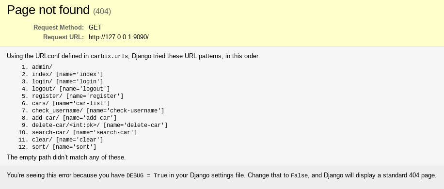
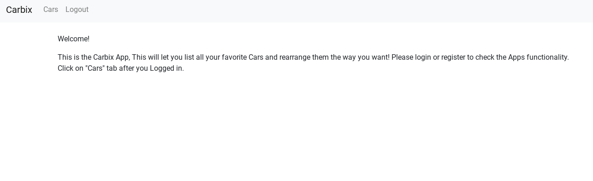
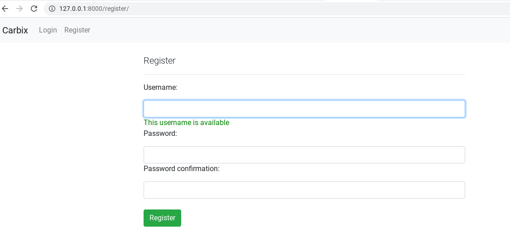
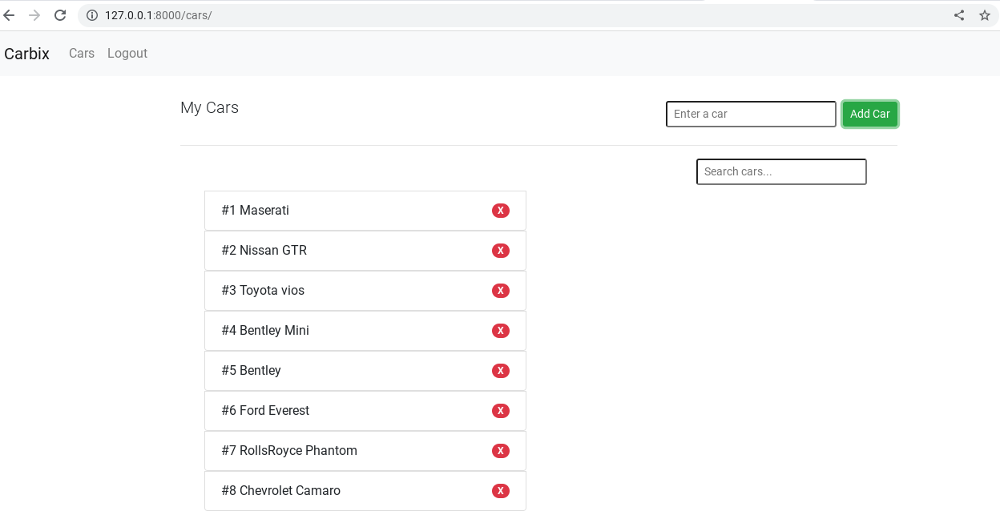
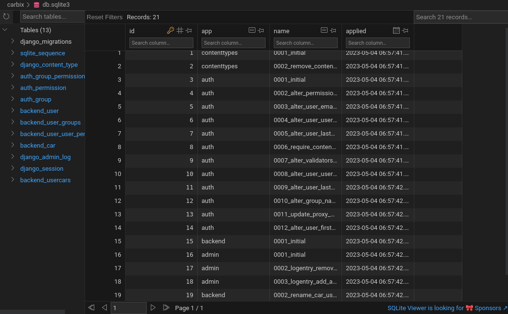
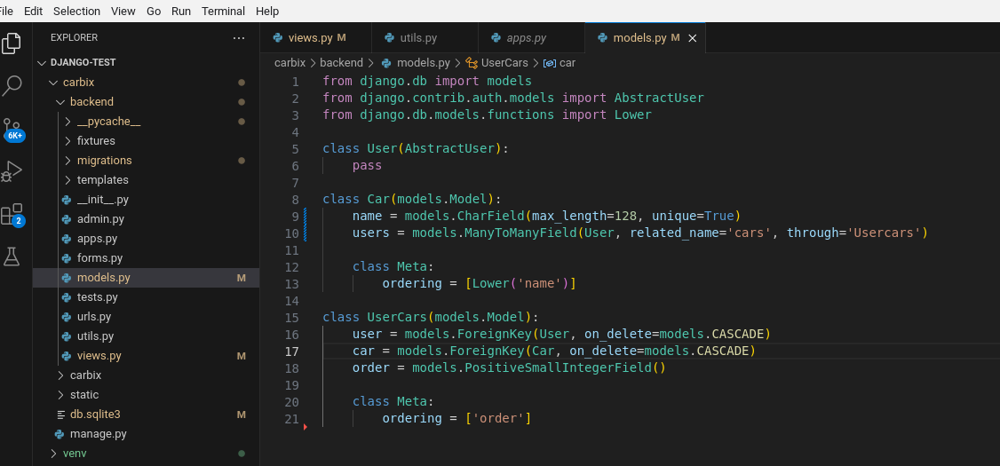
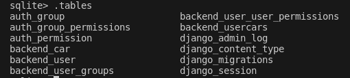

# Carbix App: A Car CRUD App Using JQUERY, Sortable.js, BOOTSTRAP, and HTMX
This is an App that let's you create and rearrange the list of available cars.

# Requirements
To use this take note for the list of modules that needs to be installed:
* *django* (to install this, just run "pip install django" in your terminal.)
* *django-extension* (to install this, just run "pip install django-extensions")
* *django-widget-tweaks* (to install this, just run "pip install django-widget-tweaks")

# Running Server
The default server port is http://127.0.0.1:8000/
Compile this in your designated folder then run "python manage.py runserver"

# URL Patterns
After you run the server in your default browser, you'll encounter this error. 

Change the URL into http://127.0.0.1:8000/index and it will route you to the Main page.

# Sign up first to login to the App.

# Interface Sorting Drag and Drop

Here you can try to rearrange the listing of Car models then it will be uodated real time.
You can search for in the ordered list for your preferred Car. 

# Database Schema and Models:

Please see here the schema using SQlite and the Models.

**SCHEMA**

**MODEL**

**TABLE**

